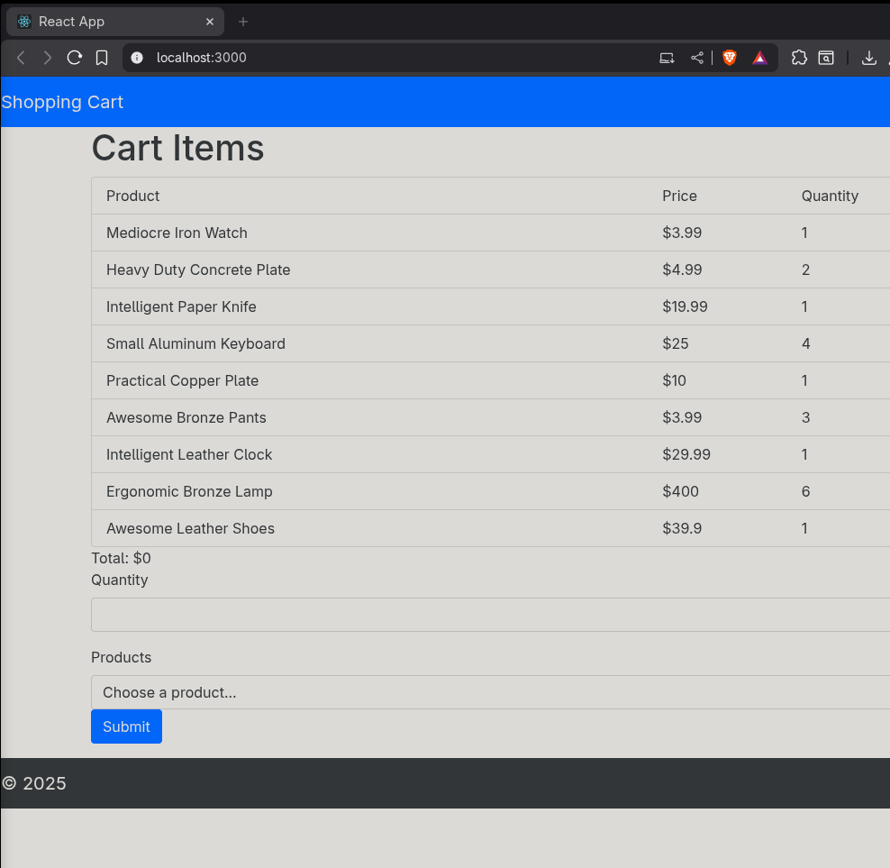

# 🛒 Shopping Cart

This project was created as part of the **Galavernize training / bootcamp / course**.  
It is a **React application** that demonstrates the basic functionality of a modern shopping cart.

The project originally comes from my old GitHub account **[@redrebelsheep](https://github.com/redrebelsheep)**  
and was developed together with **Chessinator**.

---
## 🖼️ Screenshots
```markdown
<
```

---

## 🚀 Project Description

The **Shopping Cart App** simulates a simple online store where users can view products, add them to a cart, and manage their selections.  
The main focus was to understand the core concepts of React, including:

- Component structure and props  
- State management (`useState` or `useReducer`)  
- Data flow between components  
- Dynamic rendering logic  

---

## 🛠️ Technologies Used

| Technology | Description |
|-------------|--------------|
| **React** | Frontend framework for component-based development |
| **JavaScript (ES6+)** | Modern JS syntax and functionality |
| **npm ** | Package management and build tools |
---

## 📦 Installation & Setup

```bash
# Clone the repository
git clone https://github.com/your-username/shopping-cart.git

# Navigate into the project folder
cd shopping-cart

# Install dependencies
npm install

# Start the development server
npm start
```

Then open your browser and visit  
👉 **http://localhost:3000**

---

## 💡 Learning Goals
This project was built to practice and understand:
- Building a React app from scratch  
- Working with components, props, and state  
- Handling user interactions  
- Understanding React’s data flow  
- UI design and component styling  
---

## 👥 Authors

- **[@redrebelsheep](https://github.com/redrebelsheep)** – original account  
- **[@undefined-pixel](https://github.com/undefined-pixel)** – new account  
- **[@Chessinator](https://github.com/Chessinator)** – co-developer  

---

> ✨ *“A simple project — but a big step towards mastering React.”*  
> — Galavernize training / bootcamp / course